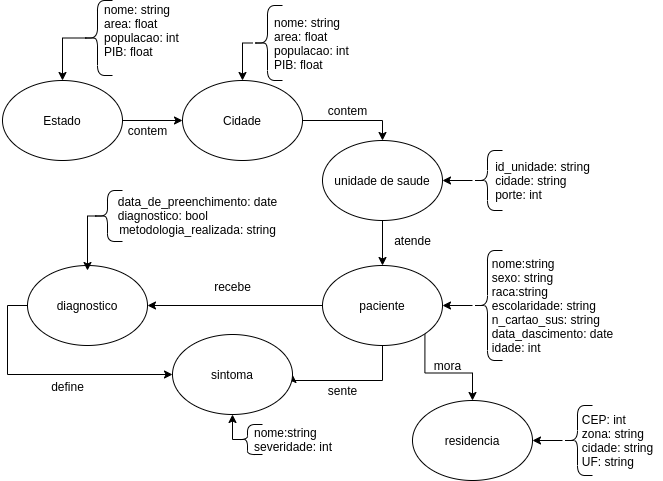

# Lab07 - Modelo Lógico para Banco de Dados de Grafos

Estrutura de pastas:

~~~
├── README.md  <- arquivo apresentando a tarefa
│
└── images     <- arquivos de imagem usados na tarefa
~~~

# Aluno
* `218733`: `Joao Pedro de Moraes Bonucci`

## Modelo Lógico do Banco de Dados de Grafos
> Utilize este [modelo de base](https://docs.google.com/presentation/d/10RN7bDKUka_Ro2_41WyEE76Wxm4AioiJOrsh6BRY3Kk/edit?usp=sharing) para construir o seu.
> Coloque a imagem do PNG do seu modelo lógico como ilustrado abaixo (a imagem estará na pasta `image`):
>
> 

## Perguntas de Pesquisa/análise

> Liste aqui as três perguntas de pesquisa/análise
> * Qual a cidade com mais casos?
> * Quais os sintomas mais frequentes?
> * Probabilidade de infecção esta relacionada com local da residencia?
