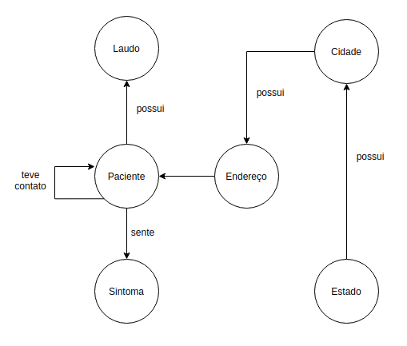

# Lab09 - Grafo de Conhecimento

Estrutura de pastas:

~~~
├── README.md  <- arquivo apresentando a tarefa
│
└── images     <- arquivos de imagem usados na tarefa
~~~

# Aluno
* `218733`: `Joao Pedro de Moraes Bonucci`

## Modelo Grafo de Conhecimento
> 

## Perguntas de Pesquisa/análise

> Perguntas de pesquisa respondids pelo graf proposto
> * Qual a cidade com mais casos?
> * Quais os sintomas mais frequentes?
> * Qual a probabilidade de infecção com contato?
